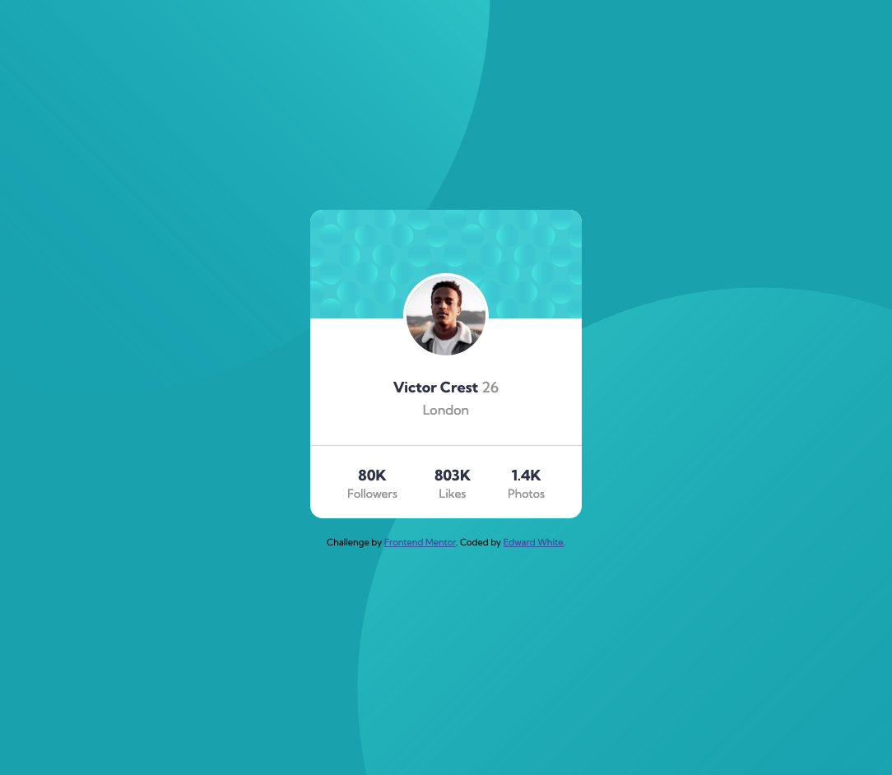

# Frontend Mentor - Profile card component solution

This is a solution to the [Profile card component challenge on Frontend Mentor](https://www.frontendmentor.io/challenges/profile-card-component-cfArpWshJ). Frontend Mentor challenges help you improve your coding skills by building realistic projects.

## Table of contents

- [Overview](#overview)
  - [Screenshot](#screenshot)
  - [Links](#links)
- [My process](#my-process)
  - [Built with](#built-with)
  - [What I learned](#what-i-learned)
- [Author](#author)

## Overview

### Screenshot



### Links

- Solution URL: [Frontend Mentor](https://www.frontendmentor.io/solutions/profile-card-component-vanilla-css-03OY7fBDa)
- Live Site URL: [GitHub Pages](https://ewhite1999.github.io/profile-card-component/)

## My process

### Built with

- Vanilla CSS
- Flexbox

### What I learned

The main things I learnt/had to look up in this project are:

- On mobile devices, setting overflow in body is overridden, you need to set it like this:

```css
.mobile_wrapper {
  overflow: hidden;
  position: relative;
}
```

## Author

- Frontend Mentor - [@ewhite1999](https://www.frontendmentor.io/profile/ewhite1999)
